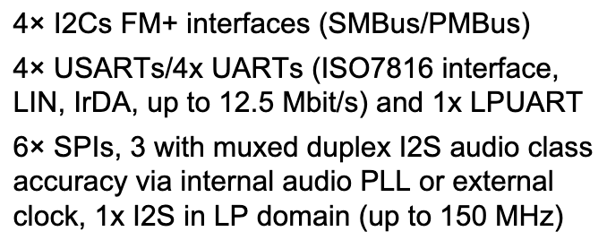
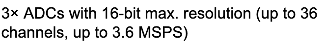

# Docs

This readme acts as a way of documenting relevant specs and notes for the hardware dev.

## Development Board

The devleopment board we are using is the NUCLEO-H753ZI and like all NUCLEO dev boards contains two MCU's a main one which you program and for which the development board is designed and another MCU running STM's ST-LINK firmware.
### Debugger MCU

The Debugger MCU running the ST-LINK firmware is the STM32F723IEK. ST-LINK provides us some useful functionality such as

    - Flashing the main MCU
    - Communication between main MCU and PC via Virtual COM Port (UART bridge)
    - Debug main MCU code

### Main MCU

STM32H753ZI

Package: LQFP144

# STM32H753ZI

## GPIO Pins:

  

### Commuication Peripherals (Digital)

  

### Analog Peripherals

  

tabulated

| Peripheral type             | How many | Notes                                                                                |
| --------------------------- | -------- | ------------------------------------------------------------------------------------ |
| **USART (full)**            | 4        | Full-function USARTs: async, sync, LIN, IrDA, ISO7816 etc. ([STMicroelectronics][1]) |
| **UART (async only)**       | 4        | Simpler asynchronous UARTs ([STMicroelectronics][1])                                 |
| **LPUART (low-power UART)** | 1        | Lower-power single UART interface ([STMicroelectronics][1])                          |

[1]: https://www.st.com/en/microcontrollers-microprocessors/stm32h753zi.html?utm_source=chatgpt.com "STM32H753ZI | Product"

## Sensors

| **Sensor**                                                                                                                          | **Communication / Output Type** | **MCU Peripheral Required** | **Typical Voltage / Interface** | **Calibration Required**                       |
| ----------------------------------------------------------------------------------------------------------------------------------- | ------------------------------- | --------------------------- | ------------------------------- | ---------------------------------------------- |
| **[Turbidity](https://core-electronics.com.au/uart-non-contact-optical-turbidity-sensor-for-arduino.html)**                         | UART (TTL serial, digital)      | UART / USART                | 3.3 V or 5 V TTL UART (TX/RX)   | Factory-calibrated (optional field validation) |
| **[pH](https://core-electronics.com.au/gravity-analog-ph-sensor-meter-pro-kit-v2.html)**                                            | Analog voltage output           | ADC                         | ~0–3 V analog output            | **Yes** (2-point or 3-point calibration)       |
| **[Dissolved Oxygen](https://core-electronics.com.au/gravity-analog-dissolved-oxygen-sensor-meter-kit-for-arduino-pre-order.html)** | Analog voltage output           | ADC                         | ~0–3 V analog output            | **Yes** (temperature & air calibration)        |
| **[Temperature](https://core-electronics.com.au/piicodev-precision-temperature-sensor-tmp117.html)**                                | I2C (digital)                   | I2C                         | 3.3 V I2C (SDA/SCL)             | No (factory calibrated)                        |

## Pin choices

### USART

The turbidity sensor is the only `UART` sensor, it is asynchronous having only TX/RX pins. Thus we have all 9 UART peripherals at our disposal.

|        | USART1          | USART2          | USART3                      | UART4                                   | UART5 | USART6         | UART7                 | UART8        |
|--------|-----------------|-----------------|-----------------------------|------------------------------------------|-------|----------------|-----------------------|--------------|
| **TX** | PA9 or PB6 or **PB14**     | PA2 or PD5      | PB12 or PC10 or PD8         | PA11 or PB9 or PC10 or PD1 or PH13        | PC12  | PC6 or PG14    | PA15 or PE8 or PF7    | PE1 or PJ8   |
| **RX** | PA10 or PB7 or **PB15**     | PA3 or PD6      | PB11 or PC11 or PD9         | PA12 or PB8 or PC11 or PD0 or PH14 or PH19| PD2   | PC7 or PG9     | PA8 or PE7 or PF6     | PE0 or PJ9   |

** Highlighed pins are the default selection in STMCube32IDE**

### I2C

#### I2C Types

The H753ZI uses FM+

| I²C mode                 | Max clock |
| ------------------------ | --------- |
| Standard-mode (SM)       | 100 kHz   |
| Fast-mode (FM)           | 400 kHz   |
| **Fast-mode Plus (FM+)** | **1 MHz** |
| High-speed mode (Hs)     | 3.4 MHz   |

| Signal        | I2C1 | I2C2 | I2C3 | I2C4 |
|---------------|------|------|------|------|
| SCL (Clock)   | PB8  | PF1  | PH7  | PD12 |
| SDA (Data)    | PB9  | PF0  | PH8  | PD13 |

### I2C signals

`I2Cx_SCL` - serial clock line

`I2Cx_SDA` - serial data line

`I2Cx_SMBA` - SMBus alert - allows a slave device to signal an alert to the host

Im not sure what we need to deal with the SMBus. So I have only supplied the clock and data pins.

### I2C pins
$$
\begin{array}{l|cccc}
\textbf{Signal} & \textbf{Sensor 1} & \textbf{Sensor 2} & \textbf{Sensor 3} & \textbf{Sensor 4} \\
\hline
\text{I2C SCL (Clock)} &  &  &  &  \\
\text{I2C SDA (Data)}  &  &  &  & 
\end{array}
$$

### Analog Pins

ADC123 is just short hand for all  of ACD 1,2 and 3.

| Port | ADC Functions |
|------|---------------|
| PF3  | ADC3_INP5 |
| PF4  | ADC3_INN5, ADC3_INP9 |
| PF5  | ADC3_INP4 |
| PF6  | ADC3_INN4, ADC3_INP8 |
| PF7  | ADC3_INP3 |
| PF8  | ADC3_INN3, ADC3_INP7 |
| PF9  | ADC3_INP2 |
| PF10 | ADC3_INN2, ADC3_INP6 |
| PC0  | ADC123_INP10 |
| PC1  | ADC123_INN10, ADC123_INP11 |
| PC2_C | ADC3_INN1, ADC3_INP0 |
| PC3_C | ADC3_INP1 |
| PA0  | ADC1_INP16 |
| PA1  | ADC1_INN16, ADC1_INP17 |
| PA2  | ADC12_INP14 |
| PA3  | ADC12_INP15 |
| PA4  | ADC12_INP18 |
| PA5  | ADC12_INN18, ADC12_INP19 |
| PA6  | ADC12_INP3 |
| PA7  | ADC12_INN3, ADC12_INP7 |
| PC4  | ADC12_INP4 |
| PC5  | ADC12_INN4, ADC12_INP8 |
| PB0  | ADC12_INN5, ADC12_INP9 |
| PB1  | ADC12_INP5 |
| PF11 | ADC1_INP2 |
| PF12 | ADC1_INN2, ADC1_INP6 |
| PF13 | ADC2_INP2 |
| PF14 | ADC2_INN2, ADC2_INP6 |

## Communication from STM to PC

There are two ways to do this, PC's can only take a USB interface, so either we use the USB to UART bridge like VCP or UART 'like' interface such as USB CDC

### USB CDC (main MCU)

**READ THIS FIRST** 

#### USB Classes

Before going onto CDC it is worth noting that the USB standard implements various USB classes which are standardized protocols which defining how a USB device behaves and what driver the OS should use. The OS ships with only a few built-in drivers that know how to handle specific USB classes. This is why you often find non-standard USB devices require you to download special firmware. Common classes:

| Class           | Appears as       |
| --------------- | ---------------- |
| CDC (ACM)       | Serial port      |
| HID             | Keyboard, mouse  |
| MSC             | USB drive        |
| Audio           | Sound card       |
| Video           | Webcam           |
| DFU             | Firmware updater |
| Vendor-specific | Custom           |

The main MCU has has native USB pins which means we can implement any USB class (or combination thereof) given we flash the correct firmware, STM32Cube already supports

- CDC (serial)
- HID (keyboard/mouse/custom HID)
- MSC (flash drive)
- DFU (firmware update)

THE USB Communications Device Class (CDC) is a USB class that lets the an MCU pretend to be a serial (COM) port over USB which when connected to a PC's USB interface appears as a virtual serial port (COM port on Windows or in `/dev/ttyACM*` on Linux/macOS). 

#### Why use the CDC Class?

When you use USB CDC, your MCU appears as a 'serial port' which uses a UART style model which is simple to implement.

### ST-LINK Virtual COM Port (debugger MCU)

ST-LINK VCP is a USB-to-UART adapter that happens to be built into the debugger. Like USB-CDC is uses the CDC class for the USB interface. How is it then different from USB-CDC? Well with VCP you don’t implement USB at all you write the code as though it was a UART pin which is much easier to implement

### My recommendation

Use ST-LINK VCP for now since its easy to implement. Since we haven't decided how to actually want to communicate back to base (PC) it's not worth the engineering hours to implement the USB protocol.

